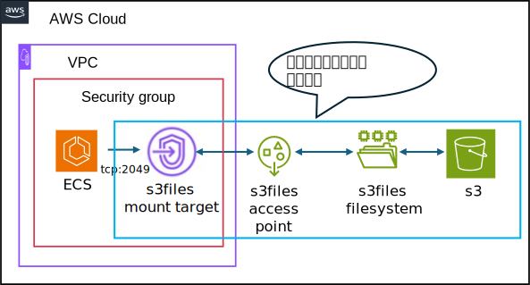

## 目的
コンテナ基盤では、ストレージとしてs3filesをデプロイするためのテンプレートを提供します。

## 概要図
 

 
 

## 提供テンプレート(CloudFormation)

| ファイル名 | 用途 | 保存先 (S3 URL) | 
| --- | --- | --- |
| [s3files-template.yml](https://ap-northeast-1.console.aws.amazon.com/cloudformation/home?region=ap-northeast-1#/stacks/quickcreate?templateURL=https://dgcp-container-guide-311141522354.s3.ap-northeast-1.amazonaws.com/deploy/infrastructure/files/template/s3files-template.yml){: target="_blank"} | s3filesテンプレート | `https://dgcp-container-guide-311141522354.s3.ap-northeast-1.amazonaws.com/deploy/infrastructure/files/template/s3files-template.yml` |

{: .note}  
DGCPのAWSへログインした状態でymlリンクを開き、以下パラメータを入力/変更してください。  

## 入力パラメータ
### Project Configuration

| パラメータ名 | 必須項目 | デフォルト | 説明 |  
| --- | --- | --- | --- |
| SystemId | 〇 | - | 実行するシステム識別子を入力 |  
| EnvType | 〇 | - | [環境種別](/faq/dgcp_environment.html){:target="_blank"}を選択 |  
| BillingID | 〇 | - | 請求IDを入力 | 
| SecurityGroupIds | 〇 | - | [セキュリティグループ](/flow/#req3){:target="_blank"}を選択。  secg-<環境識別子>-<システム識別子>-pri-01を選択 |   

### s3files Configuration

| パラメータ名 | 必須項目 | デフォルト | 説明 |  
| --- | --- | --- | --- |  
| BucketNameSuffix | 〇 | files-01 | s3バケットのSuffixを入力  |  
| AccessPointEnabled | 〇 | true | s3filesのアクセスポイントの有無を選択。 ECSの場合trueを選択 |
| AccessPointUid | - | 5001 | iaptom01usr(5001)を想定したデフォルト設定 ユーザIDを入力する |
| AccessPointGid | - | 500 | iaptom_grp(500)を想定したデフォルト設定 グループIDを入力する。 |  
| TaskRoleName | - | - | s3filesをマウントするタスク定義で利用しているタスクロール名を入力。 s3filesで必要なIAMポリシーをアタッチします |  

### KMS Configuration

| パラメータ名 | 必須項目 | デフォルト | 説明 |  
| --- | --- | --- | --- |
| KMSKeyArn | - | - | KMSKeyのARNを入力 |  

{: .tip}  
・DGCPのKMSキー`<AWSアカウントID>-kms`  
・各担当者でKMSキー`要作成`  
どちらかのKMSキーで暗号化してください。  

{: .important}  
KMS暗号化は、情報区分「`極秘・取り扱い厳重注意`」時のみ必須となります。  

## 出力リソース

| リソースの種類 | 出力例 |
| --- | --- |
| S3Bucket  | s3-t-ccntnt-files-01 |  
| S3FileSystem | fs-t-ccntnt-files-01 |  
| S3FileAccessPoint | ap-fs-t-ccntnt-files-01 |  
| ManagedPolicy | pol-client-fs-t-ccntnt-files-01 |  

{: .note}  
出力例は、下記の入力パラメータを設定した場合に出力される値です。
  
| パラメータ名 | 値 |  
| --- | --- |
| SystemId | ccntnt |  
| EnvType | t |
| BucketNameSuffix | files-01 |
| AccessPointEnabled | true |

## ECSにマウントする
* [s3filesをECSにマウントする](../../manual/s3files-mount-to-ecs.html){: target="_blank"}を参照してください。  
  