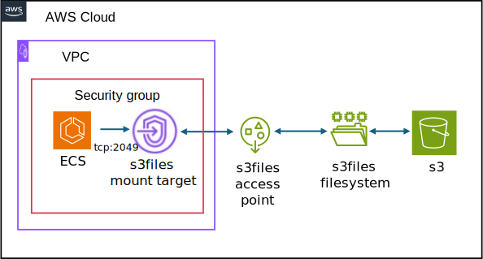
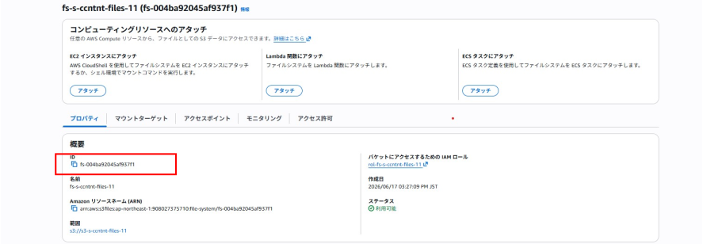
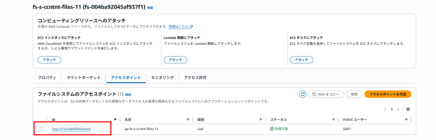
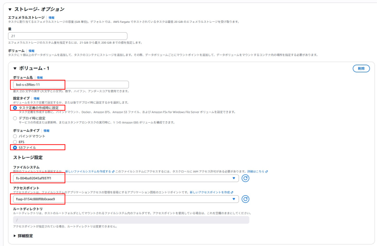
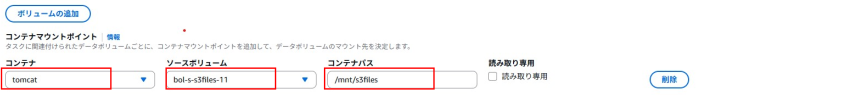
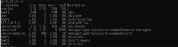

<details open markdown="block">
  <summary>
    目次
  </summary>
  {: .text-delta }

  - TOC
  {:toc}
</details>

---

# s3filesを作成しECSにマウントする  



## s3filesを作成する

[テンプレートを利用](../../infrastructure/s3files.html)して、s3filesを作成します。  

作成したs3filesより、ファイルシステムIDとアクセスポイントIDを控えておいてください。  
後ほどECSのタスク定義で利用します。

  

  


## ECSに作成したs3filesをマウントする

### ボリュームの追加  

タスク定義で新しいリビジョンを作成します。  
ストレージを追加し、ボリュームの設定を行います。  

  

| 設定項目 | 設定値 | 備考 |  
| --- | --- | --- |  
| ボリューム名 | 任意 | - |  
| 設定タイプ | タスク定義の作成時に設定 | - |  
| ボリュームタイプ | s3ファイル| - |    
| ファイルシステム | テンプレートで作成したファイルシステムIDを指定 | - |  
| アクセスポイント | テンプレートで作成したアクセスポイントIDを指定 | - |  


### コンテナマウントポイント  
  

| 設定項目 | 設定値 | 備考 |  
| --- | --- | --- |  
| コンテナ | マウントするコンテナを指定 | - |  
| ソースボリューム | [設定したボリューム名](#ボリュームの追加)を指定 | - |    
| コンテナパス | 任意 | マウントするコンテナ内のディレクトリを指定 |  


### 確認  
新規作成されたタスクへ [ECS exec](https://dgcp-container-guide-public.dentsu.jp/operation/ecsexec.html){:target="_blank"}を用いてログイン。 s3filesがマウントされていることを確認します。

```powershell  
#ECS exec の実行
aws ecs execute-command --cluster ＜クラスター名＞ --task ＜実行中のタスクARN＞ --container ＜コンテナ名＞ --interactive --command "/bin/sh"

#マウントされているかの確認
df -h
```  
コマンド実行後、[コンテナマウントポイント](#コンテナマウントポイント)で指定したディレクトリがマウントされていれば完了です。 

  
