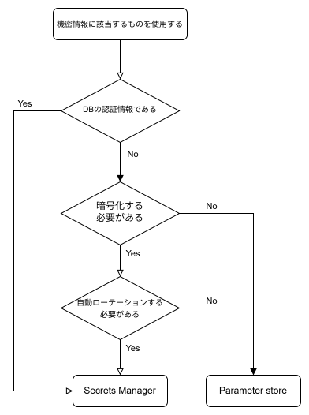

<details open markdown="block">
  <summary>
    目次
  </summary>
  {: .text-delta }

  - TOC
  {:toc}
</details>

---

# 機密情報の保管方式
機密情報に該当するAPIキーや認証情報を外部保管する際に利用する、[Secrets Manager](https://docs.aws.amazon.com/ja_jp/secretsmanager/latest/userguide/intro.html){:target="_blank"} と [Parameter Store](https://docs.aws.amazon.com/ja_jp/systems-manager/latest/userguide/systems-manager-parameter-store.html){:target="_blank"}についての比較と、使用方法について記載します。  
要件に合わせてどちらを扱うか判断し、利用してください。  

## 結論  

{: .note}  
CS部の動きとしてデータベースの認証情報に関してキーローテーションを設けようとしている動きがあるため、  
DBの認証情報の格納場所は、原則`Secrets Manager`を推奨いたします。

{: .note}  
後述のフローチャートでも記載がある通り、自動ローテーションが必要なものについてはSecrets Manager、自動ローテーションしないものについては料金の安いParameter storeを使用してください。  

《ユースケース》  
- Secrets Manager  
    - RDSのDBパスワード管理
    - 外部APIキーの安全な保存と更新
    - アプリケーションの認証情報の集中管理
- Parameter Store  
    - アプリケーションの環境設定
    - CI/CDパイプラインでの構成値の管理
    - 機密性の低い設定値の保存

《優位性》  
- Secrets Manager  
    - 自動ローテーション：DB認証情報などを定期的に更新する必要がある場合に最適
    - セキュリティ重視：アクセスログやタグ管理がしやすく、監査にも強い
- Parameter Store  
    - コスト効率：標準パラメータは無料で利用可能
    - 設定管理：環境変数や構成情報の管理に適している
    - 階層構造：パラメータ名に階層を持たせて整理可能

《比較表》  

|  | Secrets Manager | Parameter Store(standard) | Parameter Store(advanced) |  
| --- | --- | --- |  --- |
| 暗号化 | 可能(KMS) | 可能(KMS) | 可能(KMS) |
| パラメータ（1つのシークレット）ごとの料金 | 0.40USD/月 | 追加料金なし | 0.05 USD |    
| API使用料金 | 1万回ごとに 0.05 USD | 追加料金なし | 1万回ごとに 0.05 USD |  
| 自動ローテーション | 可 | 不可 | 不可 |  
| アクセス制御 | IAMで可能 | IAMで可能 | IAMで可能 |  

《フローチャート》  
  
  

## Secrets Manager の機能  
### 自動ローテーション  
シークレットを定期的に変更することはセキュリティのベストプラクティスです。  
Secrets Manager は、特定のスケジュールに基づいてシークレットを自動的にローテーション（更新）する機能を提供します。これにより、セキュリティリスクを低減し、シークレットの管理を自動化できます。  

### バージョン管理   
シークレットの変更履歴を追跡し、以前のバージョンのシークレットにアクセスすることができます。これにより、変更が原因で問題が発生した場合に、簡単に以前の状態に戻すことが可能です。  

### アクセス制御
Secrets Manager は、`リソースベースポリシー`と`IAMベースポリシー`の２つにより制御が可能です。
従ってAWS アカウント間でシークレットを共有する機能も提供します。これにより、複数のアカウントが同じシークレットを使用する場合に、それらを一元的に管理できます。  

## Parameter Store の機能  
### パラメータの保存と階層化  
Parameter Storeでは、構成データや秘密情報をパラメータとして保存できます。これらのパラメータは階層的に整理することができ、例えば
```
/ccntnt/prd/tomcat/SPRING_DATASOURCE_URL
/ccntnt/prd/tomcat/SPRING_DATASOURCE_USERNAME
/ccntnt/prd/tomcat/SPRING_DATASOURCE_PASSWORD
```
のようなパスを使用して整理することが出来ます。  

### バージョン管理  
パラメータの各変更をバージョンとして保存します。これにより、過去のバージョンに簡単に戻すことができ、変更管理が容易になります。  
また、Advanced Parameterでは有効期限を設定することも可能です。   

### アクセス制御
Paramter Storeは、`IAMベースポリシー`でのみ制御が可能です。
但し、一部制限があるもののResource Access Manager(RAM)によってクロスアカウントアクセスが可能となりました。
詳細は、[SSMパラメータストアがRAMを使用してクロスアカウントで共有できるようになっていたので試してみる](https://dev.classmethod.jp/articles/cross-account-sharing-of-ssm-parameter-store-in-ram/){: target="_blank"}を参照してください。  