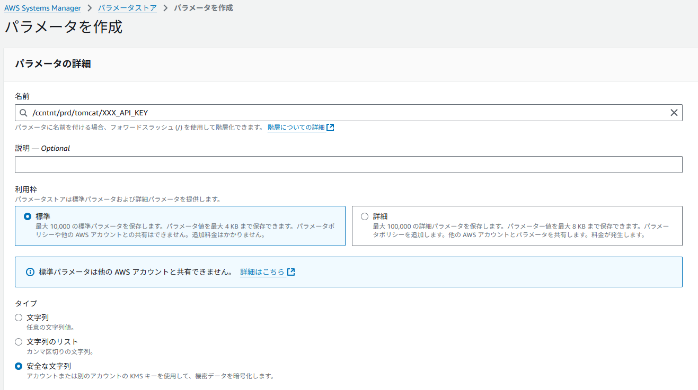
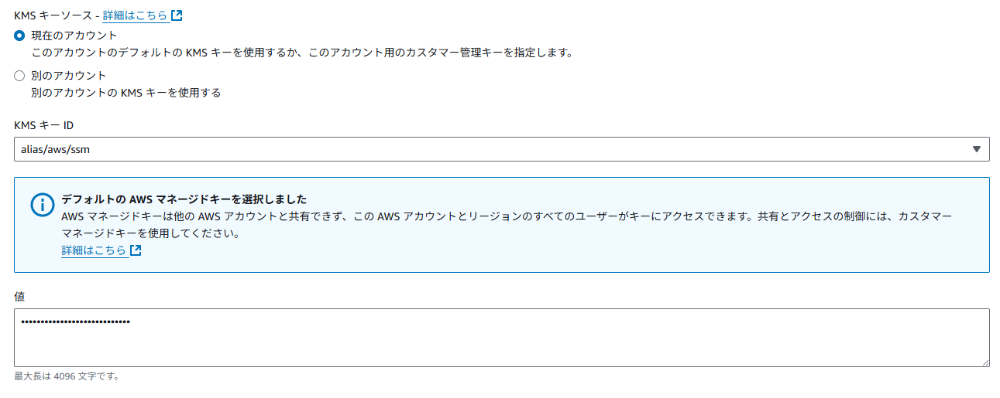
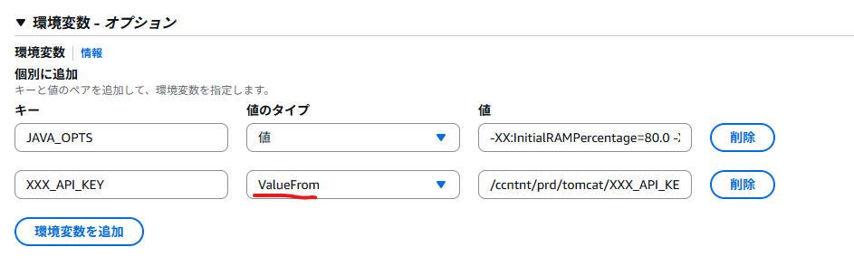

## パラメータの作成
AWS Systems Manager > パラメータストア > パラメータの作成 を押下します

1. パラメータの名前を入力します。

2. 利用枠を`標準` または `詳細（Advaned）`か選択します。

3. タイプ`安全な文字列`を選択します。  
    ※平文の場合は、タスク定義に直接記載してもよいため。原則。



4. KMSキーソースは、要件に従い柔軟に変更してください。  
    ※デフォルト設定もOKです。  

5. パラメータに登録する値を入力します。


 
6. ページ下部の`パラメータの作成`を押下します。


## タスク定義  
### 新しいリビジョンの作成　～コンソール形式～  
`新しいリビジョンの作成` > `新しいリビジョンの作成` を押下します  

環境変数へ、以下の通り、追加してください。  
* 環境変数名
* 値のタイプ：`ValueFrom`
* 値：`《作成したパラメータストアの名前》`




<br>


### 新しいリビジョンの作成　～JSON形式～  
`新しいリビジョンの作成` > `JSONを使用した新しいリビジョンの作成` を押下します  

以下の内容を追加してください。  

```json  
"containerDefinitions": [
    {
      //～略～
        "secrets":[
          {
              "name" : "《環境変数名》",
              "valueFrom" : "《作成したパラメータストアの名前》"
          }
      ]
    }
]

//例
"containerDefinitions": [
    {
    //～略～ 
      "secrets": [
          {
              "name": "XXX_API_KEY",
              "valueFrom": "/ccntnt/prd/tomcat/XXX_API_KEY"
          }
      ]
    }
]
```