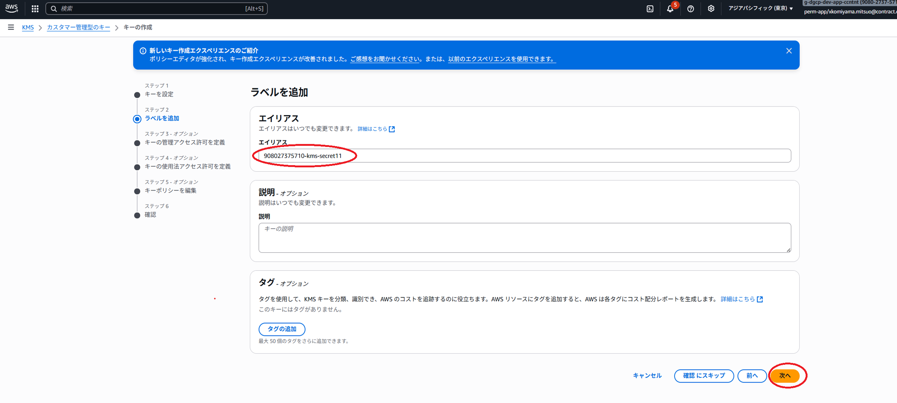
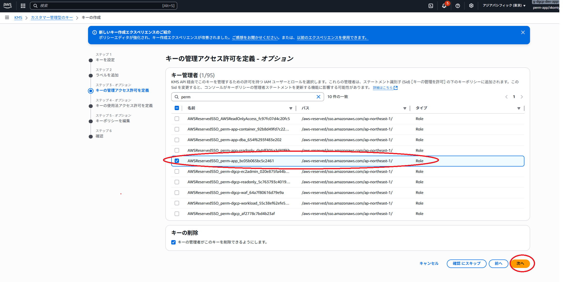
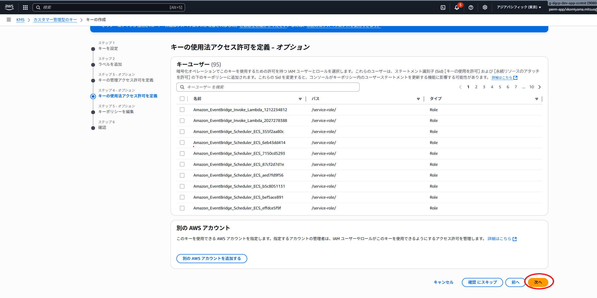
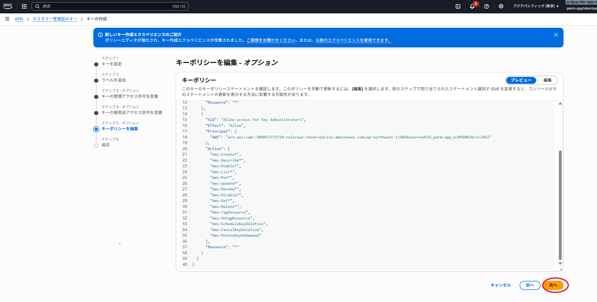
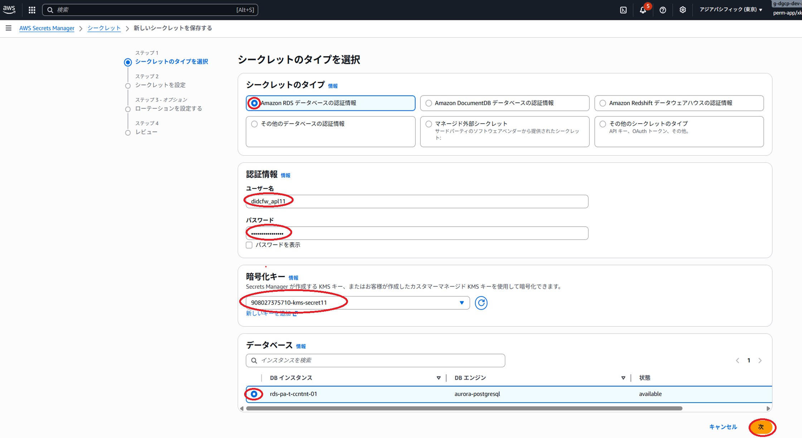
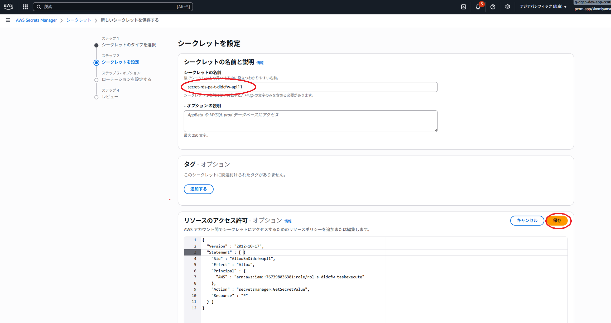
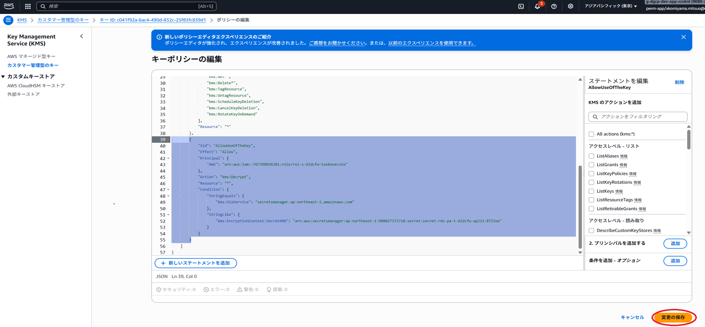
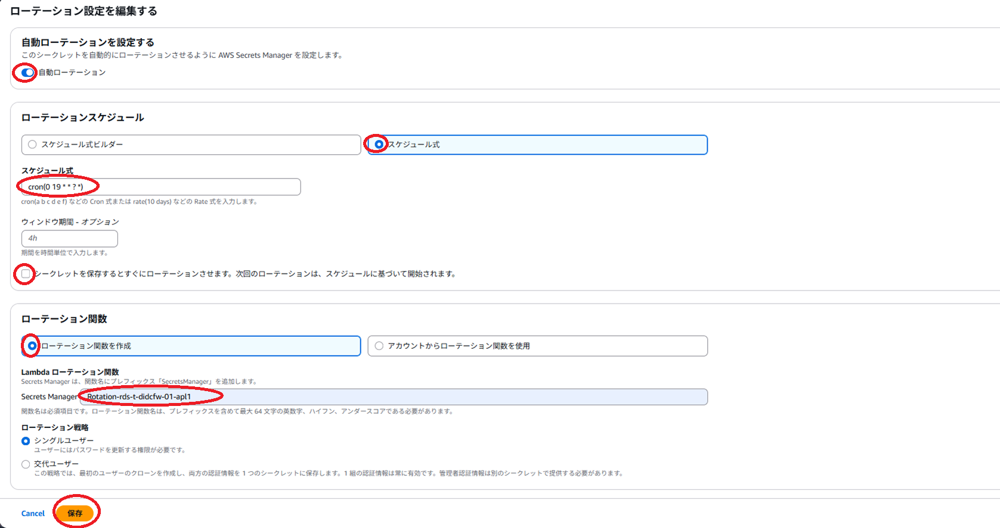
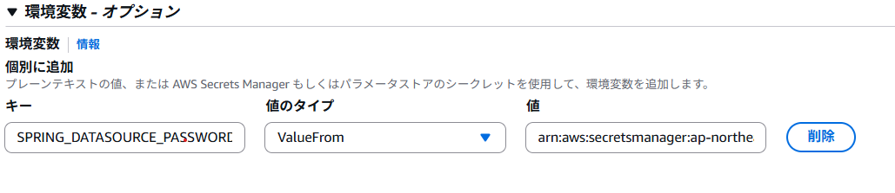

## シークレットの共有方法  
ここでは、SecretsManagerのシークレットを異なるAWSアカウントに共有する方法を記載します。  

概要図  
青枠のAWSアカウントから赤枠のAWSアカウントにシークレットを共有します。
  


## 共有方法の流れ  
①KMSキーを作成する  
②SecretsManagerにシークレットを作成し①で作成したKMSキーを指定する  
③RDSにユーザーを作成する。  
④ ①で作成したキーポリシーを変更する。  
⑤ ②で作成したシークレットのローテーションを有効にする。  
⑥ ⑤で自動作成されたIAMロールにインラインポリシーを追加する。  
⑦ 共有されるAWSアカウント（赤枠のAWSアカウント）のタスク定義を設定する

## 共有方法の手順  
### ①KMSキーを作成する
DGCPでデフォルトで設定してある、アカウント名-kmsはキーポリシーを設定できないため、使用できません。    
新規にKMSキーを作成してください。

`KMS` > `カスタマー管理キー`> `キーの作成` を押下します   

  
次へを押下します  
<hr>

  
エイリアスを指定し、次へを押下します  
<hr>

  
キーの管理者アクセス許可を定義で「AWSReservedSSO_perm-app_」で始まるロールを選択します  
<hr>

  
キーの使用法アクセス許可を定義は設定せず、次へを押下します  
<hr>

  
キーを編集は設定せず、次へを押下し、次の画面で完了を押下します  
<hr>


### ②シークレットマネージャにシークレットを作成する
`AWS Secrets Manager` > `シークレット`> `新しいシークレットを保存する` を押下します  

  

| 設定項目 | 設定値 |  
| --- | --- |  
| シークレットのタイプ | Amazon RDS データベースの認証情報 |  
| ユーザー名 | RDSに作成するユーザー名 |    
| パスワード| RDSに作成するパスワード |  
| 暗号化キー | ①で作成した暗号キー |  
| データベース | 対象のRDSインスタンス |  


次へを押下します
<hr>

  
シークレットの名前とリソースのアクセス許可を設定し保存  
リソースのアクセス許可には下記の内容を参考に共有するタスク実行ロールのARNを入力し保存してください。  
`Principal`の値を変更して使用してください。  
```json1  
{
  "Version" : "2012-10-17",
  "Statement" : [ {
    "Sid" : "AllowSmDidcfwapl1",
    "Effect" : "Allow",
    "Principal" : {
      "AWS" : "タスク実行ロールのARN"
    },
    "Action" : "secretsmanager:GetSecretValue",
    "Resource" : "*"
  } ]
}
```

次へを押下します
<hr>

  
ここでは、自動ローテーションを設定せず、次へを押下し保存します
<hr>

### ③RDSにユーザーを作成する。
下記のドキュメントを参照し、②で登録したユーザーとパスワードをRDSに登録してください  
[データベース利用ガイド](https://dgcp-db-guideline.dentsu.jp/construction.html#_1_2_db%E3%83%A6%E3%83%BC%E3%82%B6%E3%81%A8%E3%83%91%E3%82%B9%E3%83%AF%E3%83%BC%E3%83%89%E3%81%AE%E7%AE%A1%E7%90%86%E3%81%AB%E3%81%A4%E3%81%84%E3%81%A6_aws_secrets_manager_%E3%81%AE%E4%BD%BF%E7%94%A8%E3%81%AB%E3%81%A4%E3%81%84%E3%81%A6)  

{: .warning}  
この時パスワードは②で作成したシークレットで登録したパスワードと同じものを指定してください  
<hr>

### ④ ①で作成したキーポリシーを変更しする
共有するタスク実行ロールに対しアクセスを許可を追加します。
  
`Principal`と`kms:EncryptionContext:SecretARN`の値を変更して使用してください。
`kms:EncryptionContext:SecretARN`の値を変更して使用してください。 

```json2  
    {
      "Sid": "AllowUseOfTheKey",
      "Effect": "Allow",
      "Principal": {
        "AWS": "タスク実行ロールのARN"
      },
      "Action": "kms:Decrypt",
      "Resource": "*",
      "Condition": {
        "StringEquals": {
          "kms:ViaService": "secretsmanager.ap-northeast-1.amazonaws.com"
        },
        "StringLike": {
          "kms:EncryptionContext:SecretARN": "②で作成したシークレットのARN"
        }
      }
    }
```
<hr>


### ⑤ ②で作成したシークレットのローテーションを有効にする。  
`AWS Secrets Manager` > `シークレット`> `②で作成したシークレット` を選択し`ローテーション`タブ、`ローテーションの編集`を押下します  
  

| 設定項目 | 設定値 |  
| --- | --- |  
| 自動ローテーション | ON |  
| ローテーションスケジュール | スケジュール式 |  
| シークレットを保存するとすぐにローテーション | OFF |  
| スケジュール式| 任意のcron式 |  
| ローテーション関数 | ローテーション関数を作成 |  
| Lambdaローテーション関数 | 任意の名前 |  


### ⑥ ⑤で自動作成されたIAMロールにインラインポリシーを追加する。
自動作成されたLambdaにアタッチされているIAMロールに下記のインラインポリシーを追加する。
`kms:EncryptionContext:SecretARN`の値を変更して使用してください。
```json3  
{
	"Version": "2012-10-17",
	"Statement": [
		{
			"Sid": "AllowUseOfTheKey",
			"Effect": "Allow",
			"Action": [
				"kms:Decrypt",
				"kms:DescribeKey",
				"kms:GenerateDataKey"
			],
			"Resource": "*",
			"Condition": {
				"StringEquals": {
					"kms:ViaService": "secretsmanager.ap-northeast-1.amazonaws.com"
				},
				"StringLike": {
					"kms:EncryptionContext:SecretARN": "②で作成したシークレットのARN"
				}
			}
		}
	]
}
```
### ⑦共有されるAWSアカウント（赤枠のAWSアカウント）のタスク定義を設定する
  
環境変数：SPRING_DATASOURCE_PASSWORDに「②で作成したシークレットのARN:password::」を設定します。
```json4  
　　例
    "secrets": [
        {
            "name": "SPRING_DATASOURCE_PASSWORD",
            "valueFrom": "arn:aws:secretsmanager:ap-northeast-1:908027375710:secret:secret-rds-pa-t-didcfw-apl11-BTZ5oe:password::"
        }
     ]
```


## シークレットをローテーションする上での注意事項

タスク定義で環境変数を使用しパスワードを設定する場合、タスクが起動するタイミングでパスワードが注入されます。  
シークレットをローテーションする場合、ローテーションのタイミングとタスク起動のタイミングを合わせる  
必要があります。
[Fargateリタイヤメントの自動対応](../../infrastructure/fargate-retirement-handler.html) などと組み合わせて使用するようにしてください。
