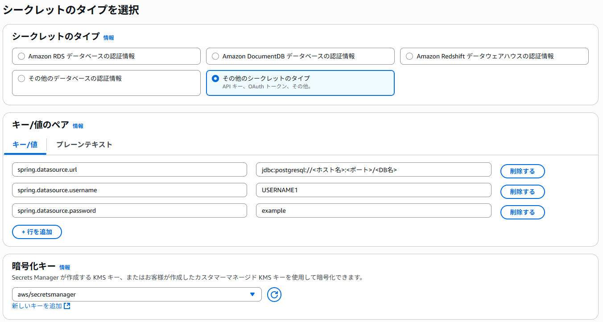
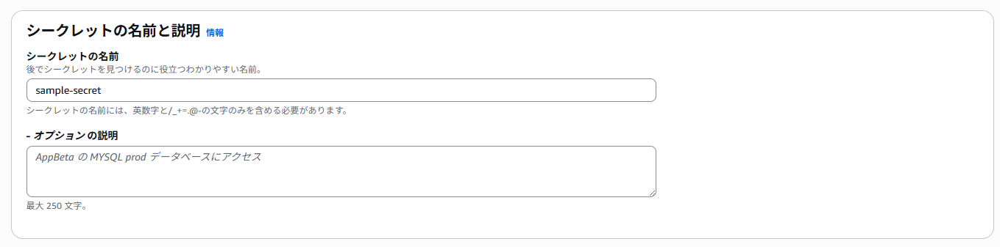
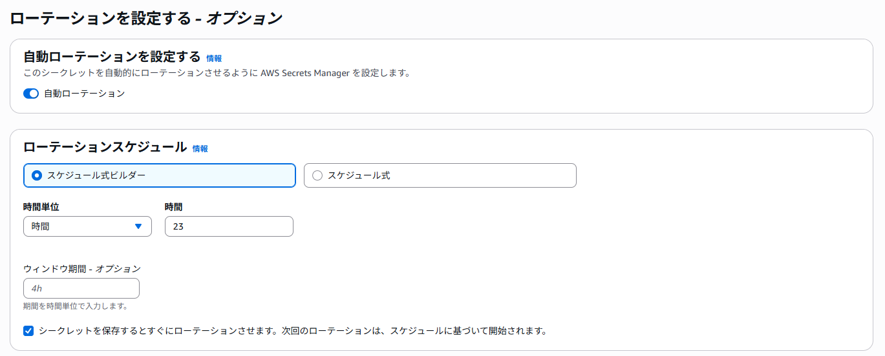
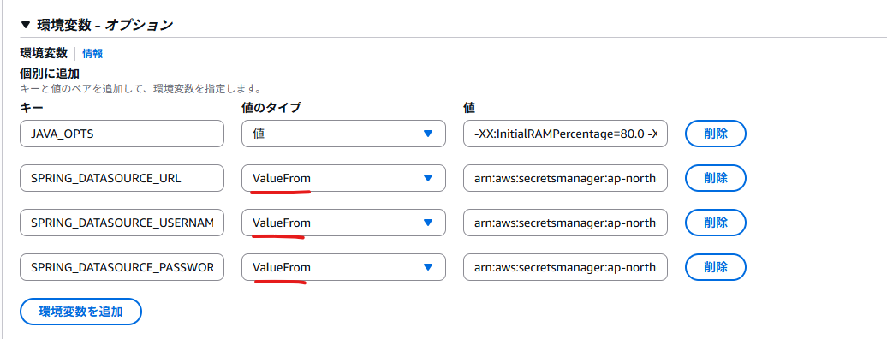

## シークレットの作成  
`AWS Secrets Manager` > `シークレット` > `新しいシークレットを保存する` を押下します  

1. **シークレットタイプを選択**  
  

    | 設定項目 | 設定値 | 備考 |  
    | --- | --- | --- |  
    | シークレットのタイプ | 任意 | 案件、保存するものによって適宜変更 |  
    | キー | 任意 | 値を呼び出すときに使用するもの |    
    | 値 | 任意 | 実際にsecretに保存するもの |  
    | 暗号化キー | aws/secretsmanager | KMSで暗号化される |  

1. **シークレットを設定**  
シークレットの名前を入力し次を押下します。  
  

1. **ローテーションを設定する**  
本項目は、<u>要件に応じて設定</u>を行ってください。  
  

1. **レビュー**  
レビューで確認し、問題なければ保存を押下し完了させてください。  


## タスク定義  
### 新しいリビジョンの作成　～コンソール形式～  
`新しいリビジョンの作成` > `新しいリビジョンの作成` を押下します  

環境変数へ、以下の通り、追加してください。  
* 環境変数名
* 値のタイプ：`ValueFrom`
* 値：`《作成したsecrets managerのARN》:《設定したキーの値》::`



<br>

### 新しいリビジョンの作成　～JSON形式～  
`新しいリビジョンの作成` > `JSONを使用した新しいリビジョンの作成` を押下します  

以下の内容を追加してください。  
```json  
"containerDefinitions": [
    {
        //～略～
        "secrets":[
            {
                "name" : "《環境変数名》",
                "valueFrom" : "《作成したsecrets managerのARN》:《設定したキーの値》::"
            }
        ]
    }
]


//例
"containerDefinitions": [
    {
        //～略～
        "secrets": [
            {
                "name": "SPRING_DATASOURCE_URL",
                "valueFrom":        "arn:aws:secretsmanager:ap-northeast-1:908027375710:secret:sample-sec:spring.datasource.url::"
            },
            {
                "name": "SPRING_DATASOURCE_USERNAME",
                "valueFrom":        "arn:aws:secretsmanager:ap-northeast-1:908027375710:secret:sample-sec:spring.datasource.username::"
            },
            {
                "name": "SPRING_DATASOURCE_PASSWORD",
                "valueFrom":        "arn:aws:secretsmanager:ap-northeast-1:908027375710:secret:sample-sec:spring.datasource.password::"
            }
        ]
    }
]
```

{: .warning}  
name（環境変数名）には「 . 」を用いることができません。  
今回の場合、` "name": "spring.datasource.username" `このように指定してしまうと表示されません。  
「 _ 」に変更するなど適宜変更してください。  