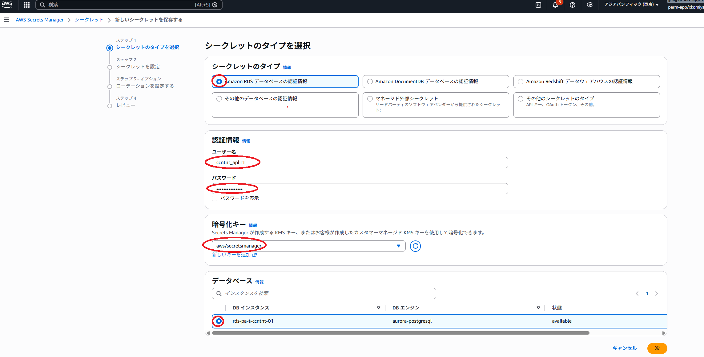
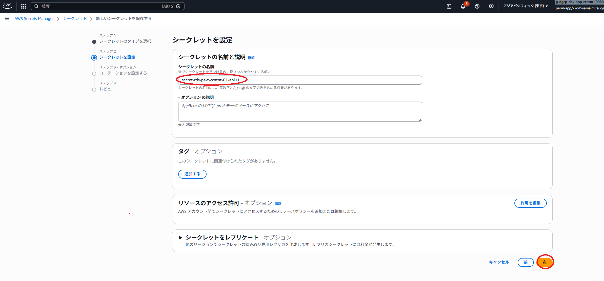
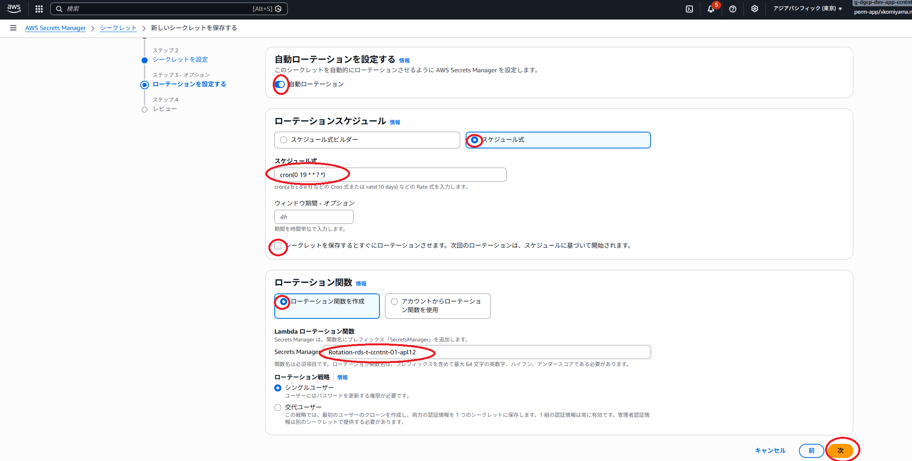
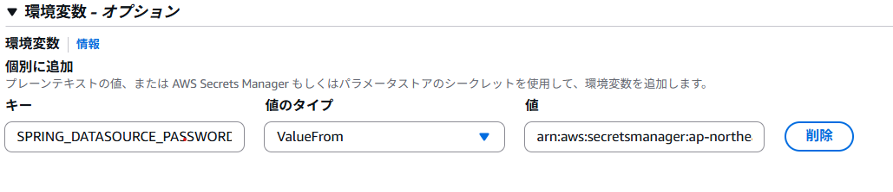

## ①シークレットの作成  
`AWS Secrets Manager` > `シークレット` > `新しいシークレットを保存する` を押下します  

**シークレットタイプを選択**  
  

| 設定項目 | 設定値 |  
| --- | --- |  
| シークレットのタイプ | Amazon RDS データベースの認証情報 |  
| ユーザー名 | RDSに作成するユーザー名 |    
| パスワード| RDSに作成するパスワード |  
| 暗号化キー | aws/secretsmanager |  
| データベース | 対象のRDSインスタンス |  

次へを押下します
<hr>

**シークレットを設定**  
  
シークレットの名前を入力し次を押下します。  
<hr>

**自動ローテーションの設定**  
  


| 設定項目 | 設定値 |  
| --- | --- |  
| 自動ローテーション | ON |  
| ローテーションスケジュール | スケジュール式 |  
| シークレットを保存するとすぐにローテーション | OFF |  
| スケジュール式| 任意のcron式 |  
| ローテーション関数 | ローテーション関数を作成 |  
| Lambdaローテーション関数 | 任意の名前 |  

次へを押下し保存します

<hr>

## ② RDSにユーザーを作成する  
下記のドキュメントを参照し、①で登録したユーザーとパスワードをRDSに登録してください  
[データベース利用ガイド](https://dgcp-db-guideline.dentsu.jp/construction.html#_1_2_db%E3%83%A6%E3%83%BC%E3%82%B6%E3%81%A8%E3%83%91%E3%82%B9%E3%83%AF%E3%83%BC%E3%83%89%E3%81%AE%E7%AE%A1%E7%90%86%E3%81%AB%E3%81%A4%E3%81%84%E3%81%A6_aws_secrets_manager_%E3%81%AE%E4%BD%BF%E7%94%A8%E3%81%AB%E3%81%A4%E3%81%84%E3%81%A6){:target="_blank"}  

{: .warning}  
この時パスワードは①で作成したシークレットで登録したパスワードと同じものを指定してください  
<hr>

## ③ タスク定義を設定する    
**新しいリビジョンの作成**  
`新しいリビジョンの作成` > `新しいリビジョンの作成` を押下します  

環境変数へ、以下の通り、追加してください。  
* 環境変数名
* 値のタイプ：`ValueFrom`
* 値：`《作成したsecrets managerのARN》:《設定したキーの値》::`


環境変数`SPRING_DATASOURCE_PASSWORD`に`①で作成したシークレットのARN:password::`を設定します。
```json1  
　　// JSON 例
    "secrets": [
        {
            "name": "SPRING_DATASOURCE_PASSWORD",
            "valueFrom": "arn:aws:secretsmanager:ap-northeast-1:908027375710:secret:secret-rds-pa-t-ccntnt-apl12-BTZ5oe:password::"
        }
     ]
```

<br>

{: .warning}  
name（環境変数名）には「 . 」を用いることができません。  
今回の場合、` "name": "SPRING.DATASOURCE.PASSWORD" `このように指定してしまうと表示されません。  
「 _ 」に変更するなど適宜変更してください。  


## シークレットをローテーションする上での注意事項

タスク定義で環境変数を使用しパスワードを設定する場合、タスクが起動するタイミングでパスワードが注入されます。  
シークレットをローテーションする場合、ローテーションのタイミングとタスク起動のタイミングを合わせる必要があります。  
[Fargateリタイヤメントの自動対応](../infrastructure/fargate-retirement-handler.html) などと組み合わせて使用するようにしてください。  
