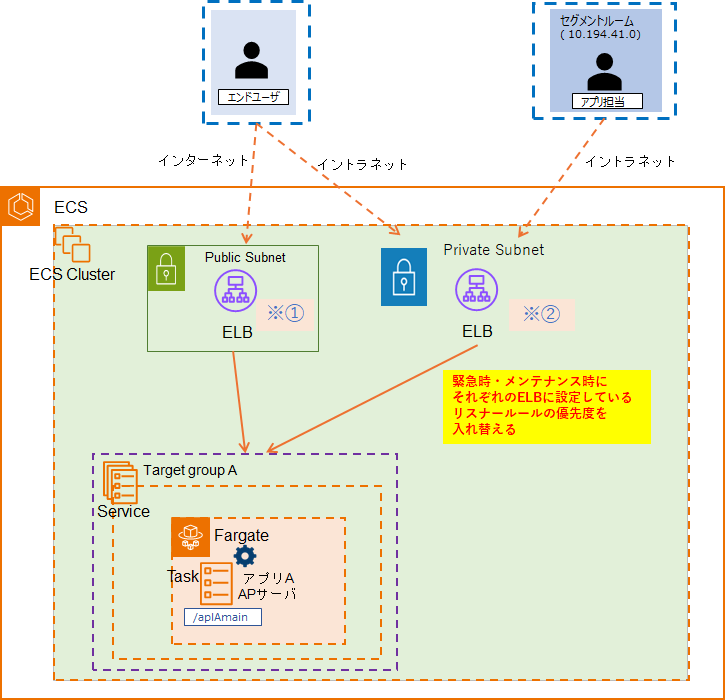
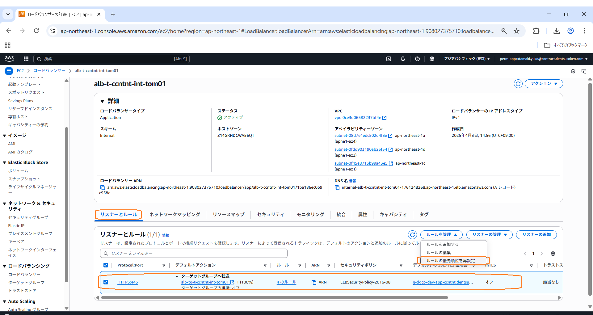
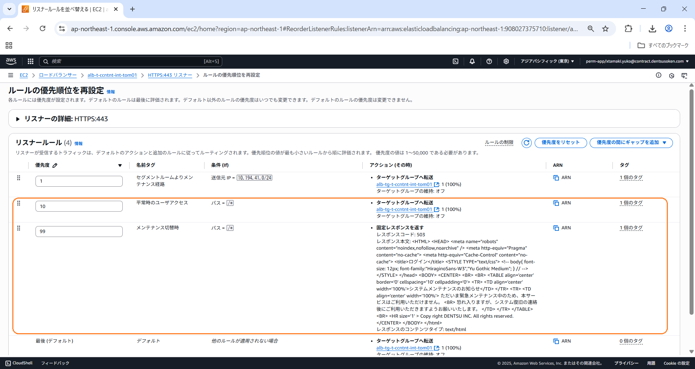
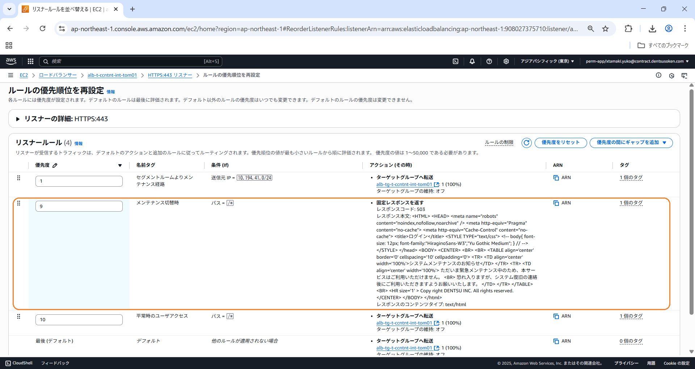

# DGCPコンテナ環境におけるメンテナンス切替方式について

## 1.メンテナンス切替方式の概要

1. メンテナンス切替方式の概要  
DGCPコンテナ環境におけるメンテナンス時または緊急時は  
主にALBのリスナールールの切り替えでメンテナンス画面表示切替の制御を行う。  
 
➀あらかじめALBのリスナールールにアプリへの正常アクセスの振り分けルールと  
　エラー返却時の振り分けルール、それぞれのルールの優先順位を設定をする。  
  ・アプリへの正常アクセス → （ルールの優先順位：上）アプリECSを設定したターゲットグループへの振り分け  
  ・エラー返却時 → （ルールの優先順位：下）ALBに設定している固定レスポンスを返す  
 
➁アプリ障害等の緊急時およびリリース等でのメンテナンスによるアクセス不可を制御する場合に  
　項番➀で設定したルールの優先順位を切り替えて、メンテナンス画面の表示切替を行う。
 
 
2. アプリ要件例に伴うメンテナンス切替方式  
下記のアプリ要件に基づいたメンテナンス画面の切り替え方式例を記載する。  
・エンドユーザーは平常時、インターネットおよびイントラネットからのアクセスが可能  
・セグメントルーム端末（10.194.41.0/24）からアプリ担当が稼働確認するため、アプリへのアクセスは常に可能な状態  
・メンテナンス・緊急時はエンドユーザーにはsorry page が表示される  
 
 
  
 
 

  * ※➀ インターネット（通常時）  
  優先度10 パスが/ aplAmainならば、 Target group Aへ転送  
  優先度99 パスが/ aplAmainならば、固定レスポンス（sorry page）を返却  
  最後  固定レスポンスを返却  
  (For assistance, contact your support team.)  
  　　　　　　↑  
  （メンテナンス用のレスポンスを返却したいタイミングでリスナールールの優先度を変更  ）  
  　　　　　　↓  
  * ※➀ インターネット（メンテナンス・緊急時）  
   優先度9 パスが/ aplAmainならば、固定レスポンス（sorry page）を返却  
   優先度10 パスが/ aplAmainならば、 Target group Aへ転送  
  最後  固定レスポンスを返却  
  (For assistance, contact your support team.)  
   
   

  * ※➁ イントラネット（通常時）  
  優先度1 送信元が10.194.41.0/24ならば、 Target group Aへ転送  
  優先度10 パスが/*ならば、 Target group Aへ転送  
  優先度99 パスが/*ならば、固定レスポンス（sorry page）を返却  
  最後   固定レスポンスを返却  
  (For assistance, contact your support team.)  
 　　　　　　↑  
  （メンテナンス用のレスポンスを返却したいタイミングでリスナールールの優先度を変更  ）  
  　　　　　　↓  
  * ※➁ イントラネット（メンテナンス・緊急時）  
  優先度1 送信元が10.194.41.0/24ならば、 Target group Aへ転送  
  優先度9 パスが/*ならば、固定レスポンス（sorry page）を返却  
  優先度10 パスが/*ならば、 Target group Aへ転送  
  最後   固定レスポンスを返却  
  (For assistance, contact your support team.)  
    
   
※➀固定レスポンスは1024文字の文字数制限があります。  
※➁他のルールが適用されない場合として、リスナールールの最後のルールは設定必須です。  
※➂sorry pageの固定レスポンスの設定には切替時の即時反映が必要となるため、クライアント側でキャッシュしないように  
　レスポンスコード: 503の設定を入れる必要があります。  
 
 
* 固定レスポンス（sorry page）  
固定レスポンスコード:　503   
固定レスポンス本文（例）:   
<pre>
  <code>
&lt;HTML&gt;
&lt;HEAD&gt;
&lt;meta name="robots" content="noindex,nofollow,noarchive" /&gt;
&lt;title&gt;ＥＳＱシステム&lt;/title&gt;
&lt;STYLE TYPE="text/css"&gt;
&lt;!--
body{
  font-size: 12px;
  font-family:"HiraginoSans-W3","Yu Gothic Medium";
}
// --&gt;
&lt;/STYLE&gt;
&lt;/head&gt;
&lt;BODY&gt;
&lt;CENTER&gt;
&lt;BR&gt;
&lt;BR&gt;
&lt;TABLE align='center' border='0' cellspacing='10' cellpadding='0'&gt;
&lt;TR&gt;
&lt;TD align='center' width='100%'&gt;システムメンテナンスのお知らせ&lt;/TD&gt;
&lt;/TR&gt;
&lt;TR&gt;
&lt;TD align='center' width='100%'&gt;
ただいま緊急メンテナンス中のため、本サービスはご利用いただけません。
&lt;BR&gt;
恐れ入りますが、システム復旧の連絡後にご利用いただきますようお願いいたします。
&lt;/TD&gt;
&lt;/TR&gt;
&lt;/TABLE&gt;
&lt;BR&gt;
&lt;HR size='1' &gt;
Copy right DENTSU INC. All rights reserved.
&lt;/CENTER&gt;
&lt;/BODY&gt;
&lt;/html&gt; 
  </code>
</pre>
  
  
 
* 最後の固定レスポンス  
固定レスポンスコード:　403   
固定レスポンス本文（例）:   
<pre>
  <code>
&lt;HTML&gt;
&lt;HEAD&gt;
&lt;meta name="robots" content="noindex,nofollow,noarchive" /&gt;
&lt;title&gt;ＥＳＱシステム&lt;/title&gt;
&lt;STYLE TYPE="text/css"&gt;
&lt;!--
body{
  font-size: 12px;
  font-family:"HiraginoSans-W3","Yu Gothic Medium";
}
// --&gt;
&lt;/STYLE&gt;
&lt;/head&gt;
&lt;BODY&gt;
&lt;CENTER&gt;
&lt;BR&gt;
&lt;BR&gt;
&lt;TABLE align='center' border='0' cellspacing='10' cellpadding='0'&gt;
&lt;TR&gt;
&lt;TD align='center' width='100%'&gt;アクセスエラー&lt;/TD&gt;
&lt;/TR&gt;
&lt;TR&gt;
&lt;TD align='center' width='100%'&gt;
For assistance, contact your support team.
&lt;/TR&gt;
&lt;/TABLE&gt;
&lt;BR&gt;
&lt;HR size='1' &gt;
Copy right DENTSU INC. All rights reserved.
&lt;/CENTER&gt;
&lt;/BODY&gt;
&lt;/html&gt; 
  </code>
</pre>
  
  

3. メンテナンス時の切り替え方（リスナールールの設定方法について）  
メンテナンス・緊急時の切り替え方は  
AWSコンソール画面からリスナールールの設定・編集を行う。  
 
➀対象のLBのリスナールールを指定し、ルールの優先順位を再設定を選択する。  

   
 
 
 
➁平常時のアプリへのアクセスルールとメンテナンス・緊急時のルールの優先順位を確認し  

   
 
 
 
➂メンテナンス・緊急時のルールの優先順位が平常時のアプリへのアクセスルールより上の順位になるように設定を変更する。  

   
 
（※aws cliからもリスナールールの編集は可能です）
 
 