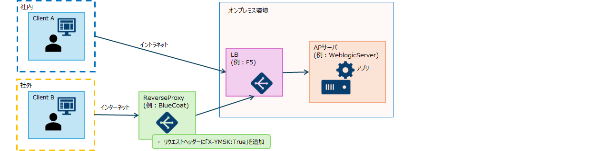
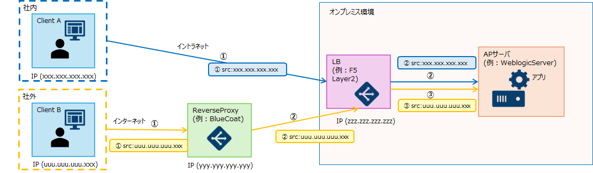
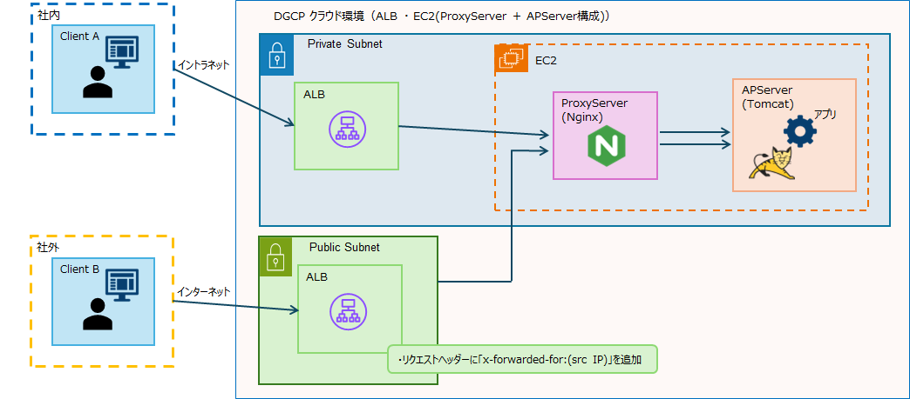
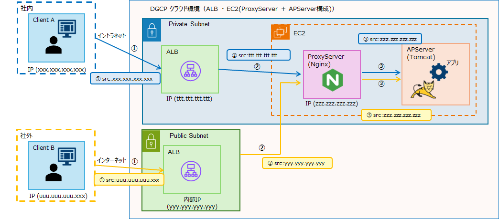
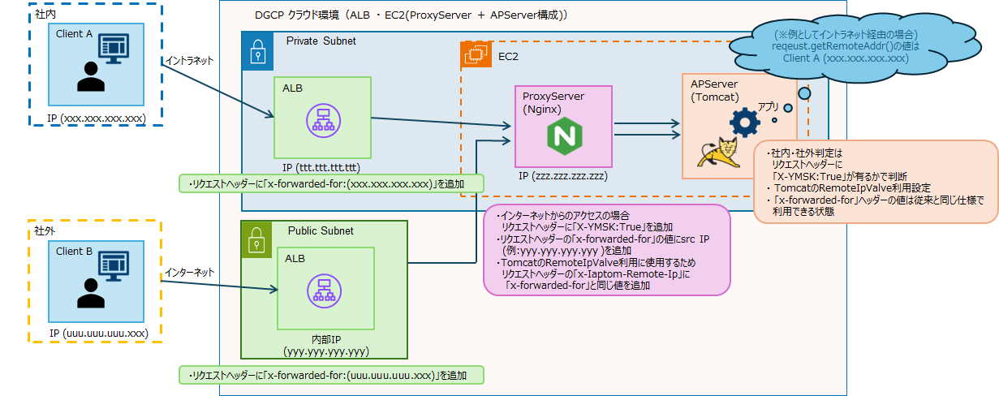
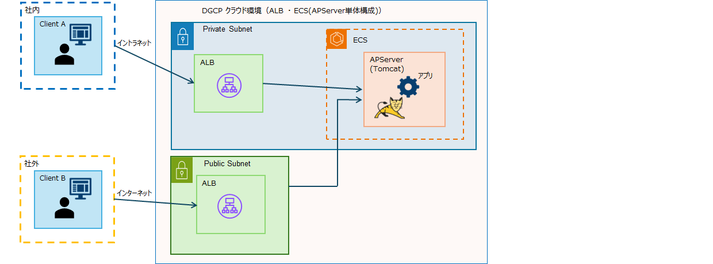

<br><br>

## DGCPコンテナと従来環境におけるソースIPの取得と社内外の判定方法の差異  


## ソースIP情報および社内外の判定情報の取得の目的
1. ソースIPの取得目的  
アプリケーションへのログイン履歴や  
障害等の調査の際にクライアント情報のトレースのためのログ出力への利用を目的としており、  
アプリケーション及びアプリケーションサーバ、プロキシサーバ（Nginx）では  
アクセスの途中経路に配置するLBで付与されたヘッダー情報を元に  
各々クライアントIPとして判別できる情報をログに出力するために取得しています。  

1. 社内外判定の取得目的  
アプリケーションの仕様によってはインターネットからのアクセスに限り、機能を制限する仕組みに利用することや  
クライアントがインターネット・イントラネットどちらからアクセスしたかをログに出力する等に  
必要な情報として取得する事があります。
<br><br>

## 1.従来の環境におけるソースIPおよび社内外の判定情報の取得の仕組みについて
 
オンプレミスとDGCPのEC2環境でのソースIPおよび社内外判定の方法は以下の通りです。  
  
1. オンプレミス環境  
オンプレミス環境の構成
        
<br><br>
オンプレミス環境ではリバースプロキシやロードバランサーはクライアントのIPアドレスを書き換え（NAT）は行わず、  
アプリケーションサーバーに送信元のアドレスをそのままリクエストを処理します。  
<br>
・オンプレミス環境における各クライアント・サーバ間通信のsrcIP情報の状態  
        
<br>
リバースプロキシやロードバランサーを経由してもバックエンドに到達する通信のsrc情報はクライアントのIPのままとなります。  
そのため、バックエンドであるアプリケーションサーバとアプリケーションサーバ上のアプリケーションは  
クライアントのIPはリクエストのsrc情報から取得が可能、そして社内外判定はリクエストヘッダーに「X-YMSK:True」の有無で判断可能でした。  
<br><br>
1. DGCP クラウド環境（ALB ・ EC2(ProxyServer + APServer構成)）  
EC2採用のDGCP クラウド環境の構成  

        
<br>
クラウド環境ではロードバランサーやプロキシサーバではクライアントのIPアドレスを書き換え（NAT）せずに処理することが不可能なため、  
バックエンドであるアプリケーションサーバとアプリケーションサーバ上のアプリケーションに到達する通信のsrcはクライアントIPとは異なります。  
<br>
・EC2採用のクラウド環境における各クライアント・サーバ間通信のsrcIP情報の状態  

        
<br>
1. DGCP クラウド環境（ALB ・ EC2(ProxyServer + APServer構成)）でのソースIPおよび社内外判定の情報取得の仕組み  
クラウドに移行しリバースプロキシを経由する構成を採用しないこと、また経由するロードバランサーのALBやプロキシサーバのNginxでは  
ソースを書き換え（NAT）せずに後続のサーバやアプリケーションへの通信処理を行うことが不可能なため  
同環境での社内外判定の処理とクライアントのIP情報の取得を可能とする仕組みを検討した結果、  
アプリケーションサーバの前段にプロキシサーバとして配置したNginxで処理と  
TomcatのRemoteIPValveという機能を併せて利用する方式を採用しました。
<br>
（※1　方式の詳細説明は「従来の開発との差異 - RemoteIpValveとNginxを組み合わせたソースIP情報および社内外判定情報の取得の仕組み」参照）  
<br><br>
・クライアントのソースIPと社内外判定の取得方式図  

        
<br>
    * ロードバランサーのALBではリクエスト情報にヘッダー「x-forwarded-for:（src IP）」の付与を行っています。  
    * プロキシサーバのNginxでは下記の処理を行っています。  
    　通信のsrcIPがPublic Subnetのレンジに含まれているか否かでインターネット経由のALBかを判別し  
    　インターネットと判別した場合にリクエスト情報にヘッダー「X-YMSK:True」を付与します。  
    　リクエスト情報にヘッダー「x-forwarded-for」に（src IP）追加付与の処理を行います。  
    　リクエスト情報にヘッダー「x-Iaptom-Remote-Ip」に上記（src IP）追加付与した後の「x-forwarded-for」の値を付与したヘッダーを作成処理を行います。  
<br><br>

## 3.ECS採用のクラウド環境とソースIPおよび社内外判定情報の取得に伴う課題

1. DGCP クラウド環境（ALB ・ ECS(APServer単体構成)）  
ECS採用のDGCP クラウド環境の構成  

        
<br>
<br>

    ECS採用のクラウド環境ではEC2環境ではプロキシサーバのNginxを配置しない構成を採用する事になり、  
    同構成では社内外判定を元に行っていたヘッダー「X-YMSK:True」の付与と  
    RemoteIPValveでクライアントIPとして判別・処理を行うヘッダー「x-Iaptom-Remote-Ip」の付与をNginxに代わって担うサーバがないため  
    EC2環境で採用していた方式をそのまま利用する事が出来なくなりました。  
<br>


    {: .important}  
    > ※RemoteIPValveの処理に「x-forwarded-for」を使用してEC2の環境と同じようにクライアント情報を取得する事は可能ですが、  
    > その場合、「x-forwarded-for」の値とソースIPが書き換わった状態でTomcatとアプリケーションに渡る状態となります。  
    
    「x-forwarded-for」の値が書き換わった状態ではリクエストの正確なトレースが出来ないため、ECS環境にあわせた対応が課題となりました。  
<br><br>

## 4.ECS採用のクラウド環境でのソースIPの取得の方法ついて  
EC2からECSに移行し、尚且つ、ProxyServerを配置しないAPServer単体の構成では  
社内外判定に必要な判別とそのヘッダーをAPServerにリクエストが届く前段で処理する事が不可能なため  
新たにアプリケーションでの対応が必要となります。  

1. reqeust.getRemoteAddr();を利用しているかつ社内外判定を行っていない場合  
RemoteIPValveの機能をEC2環境と同様に利用する方法で対応してください。  
    {: .warning}  
     **※こちらの方法は移行などでアプリケーション内のロジック修正対応が難しい場合にのみ採用するようにしてください**   
<br>

- 方法: タスク定義の環境変数で、 `REMOTE_IP_HEADER="X-Forwarded-For”` を追加してください。 
    * メリット　：実装を行わず、ソースIPの取得が可能です。
    * デメリット ：オリジナルの`X-Forwarded-For`が削除もしくは値が書き換えられているため、社内外判定が不可となります。  
<br>
2. 項番1に該当しない場合  
下記に挙げられるようにIPを `X-Forwarded-For` の先頭から取得する共通メソッドを実装ください。  

- 方法: 下記ロジック参照
    * メリット　：後述の社内外の判定が可能です。  
    * デメリット ：実装のための工数が必要です。  
<br>

```java
public static String getClientIp(HttpServletRequest request) {
        String xForwardedFor = request.getHeader("`X-Forwarded-For`");
        if (xForwardedFor != null && !xForwardedFor.isEmpty()) {
            // カンマで分割して先頭のIPを取得
            String[] ips = xForwardedFor.split(",");
            return ips[0].trim();
        }
        // ヘッダーがない場合は直接のリモートIPを返す
        return `request.getRemoteAddr();`
    }
```

## 5.ECS採用のクラウド環境での社内外判定の方法ついて  
 `request.getRemoteAddr();` で取得したIP（直前のリクエスト元IP）がDGCP上でパブリックALBが構築されるサブネットのCIDRの範囲か  
 判定を行うロジックの追加を行ってください。  
    {: .warning}  
     **※こちらの方法は項番4の1の方法を採用しない場合のみ、可能な方法です**   
<br>

```
10.154.124.0/22
10.154.128.0/22
10.154.132.0/22
10.154.210.0/23
10.154.212.0/23
10.154.214.0/23
```
上記に挙げられるCIDRが、DGCP上でパブリックALBが構築されるサブネットとなります。  
ClientIP-ALB-アプリとなり、直前のクライアントは、アプリから見てALBとなりますので、  
ALBがどこにいるかを評価する形で社外、社内の判定が行える形となります。  

```java
 * IPアドレスがレンジの中に含まれているか否かを返却します。
 * @param ipAddress IPアドレス
 * @param レンジ xxx.xxx.xxx.xxx/xx形式
 * @return true：含まれる false含まれない
 */
public static boolean containsIp(String ipAddress,String range) throws UnknownHostException {

    String[] parts = range.split("/");

    if (parts.length != 2)
      	return false;
        			
    byte[] address =  InetAddress.getByName(parts[0]).getAddress();
    int	 prefixLength = Integer.parseInt(parts[1], 10);
    byte[] target =  InetAddress.getByName(ipAddress).getAddress();
       	   	
    if (target.length != address.length)
        return false;

    int index = 0;
    int bits = prefixLength;

    for (; bits >= 8; bits -= 8)
    {
        if (target[index] != address[index])
            return false;
            ++index;
    }

    if (bits > 0)
    {
        int mask = (byte)~(255 >> bits);
        if ((target[index] & mask) != (address[index] & mask))
            return false;
    }

    return true;
}
```